  

  

  

  

## 👨🏻‍💻 | Skills Package manager

  <pre style="text-align:left; display:inline-block; padding:12px 16px; border:1px solid #3c3836; border-radius:12px; background:#0d1117; color:#ebdbb2; line-height:1.45; margin:0; max-width:920px; overflow:auto;">
┌──────────────────────────────────────────────────────────────────────────┐
❯ Loading Stack Skills [FlatpackStore]
✔ Modules detected: Frontend, Backend, Data, DevOps
⠼ Indexing toolchain… (cache: warm • lockfile: clean)

────────────────────────────────────────────────────────────────────────────
Progress [███████████████████████████░░░░░░░░░] 84/100+ units
Mode : interactive   Theme : gruvbox-dark   Latency : low
Tip : Use filters below • Search by keyword • Press ? for help
└──────────────────────────────────────────────────────────────────────────┘
  </pre>

 

  
<b>🧩 Full Stack</b> (Frontend + Backend)

   

  <!-- Frontend -->
  

    
    
    
    
    
    
    
    
    
    
    
    
    
    
  

  <!-- Backend -->
  

    
    
    
    
    
    
    
    
    
    
    
    
  

 

<!-- ✅ OUTRAS SEÇÕES (FECHADAS POR PADRÃO) -->

  
<b>🛢️ Databases & Storage</b>

   
  

    
    
    
    
    
    
    
    
    
    
    
  

  
<b>🧱 UI / Design System</b>

   
  

    
    
    
  

  
<b>✅ Testing</b>

   
  

    
    
    
    
    
    
    
    
  

  
<b>📚 API / Tooling</b>

   
  

    
    
    
    
  

  
<b>☁️ Cloud & DevOps</b>

   
  

    
    
    
    
    
    
    
    
    
  

  
<b>📊 Product / Agile</b>

   
  

    
    
    
    
    
    
    
  

  
<b>🐧 Linux / WM / CLI</b>

   
  

    
    
    
    
    
    
    
    
    
    
    
  

  
<b>🧰 IDEs / Editors</b>

   
  

    
    
    
    
    
    
    
  

  
<b>🖥️ Terminals</b>

   
  

    
    
    
  

   

----------------------------------------------------------------------------------------------------------------------------------------------------------
  
  <!-- “API Loaded” header -->
  

    <b>░▒▓TUI Loaded 🧩 SkillDeck (interactive)▓▒░</b>
  

   

  <!-- Big epic button -->
  <a href="https://dancarvofc.github.io/dancarvofc/" target="_blank"
     style="display:inline-block; padding:12px 18px; border-radius:14px;
            border:1px solid rgba(235,219,178,.25);
            background:linear-gradient(90deg, rgba(254,128,25,.18), rgba(131,165,152,.18), rgba(184,187,38,.18));
            color:#ebdbb2; text-decoration:none; font-weight:800;">
    🚀 Acess SkillDeck 2.0
  </a>

  <i>Technical Manifest • Full Stack Expertise • System Design Assets</i>

----------------------------------------------------------------------------------------------------------------------------------------------------------

 

  <!-- Terminal vibe -->
  <pre style="text-align:left; display:inline-block; padding:14px 16px; border:1px solid #3c3836; border-radius:12px; background:#0d1117; color:#ebdbb2; line-height:1.55; max-width:860px; overflow:auto;">

✔ 84/100+ Units Loaded Successfully
────────────────────────────────────────────────────────────────
❯ open --ui skilldeck --mode interactive
✓ SkillDeck ready.
  </pre>

 

///USAR DEPOIS

╰┈➤
## 💬 | Let's Connect (Mirc Mode)

<table>
  <tr>
    <td valign="center">
<pre>
╔────────────────────────────────────────╗
│  mIRC://dancarvofc  |  #lets-connect   │
|----------------------------------------|
│  Hot Topics: shipping stuff, coffee    |
|	and questionable ideas               │
│                                        │
│  <dancarvofc> /whois dan                           |             
│  <server>    Dan — Full Stack + Product        |
│                                        │
╚────────────────────────────────────────╝
</pre>
   </td>
    <td valign="top" style="padding-left:14px;">
		     
      
       
      
       
      
      
	 
    </td>
  </tr>
</table>

<h2>⛓️ | Blockchain Tip Jar</h2>

<pre>
╔════════════════════════════════════════════════════════════╗
║ node://dancarvofc  |  chain: mainnet                       ║
║ Topic: blocks, builds, and beautiful side-projects         ║
╟────────────────────────────────────────────────────────────╢
║ <you>      /tip --msg "keep shipping"                           ║
║ <miner>    block found  |  rewards: vibes + caffeine              ║
 ║ <ledger>   immutability: enabled  |  humor: enabled                ║ 
╚════════════════════════════════════════════════════════════╝
</pre>

## 📊 **GitHub Telemetry** [Prometeus Style]

  

## 🏆 LeetCode KPIs

  
  

---

